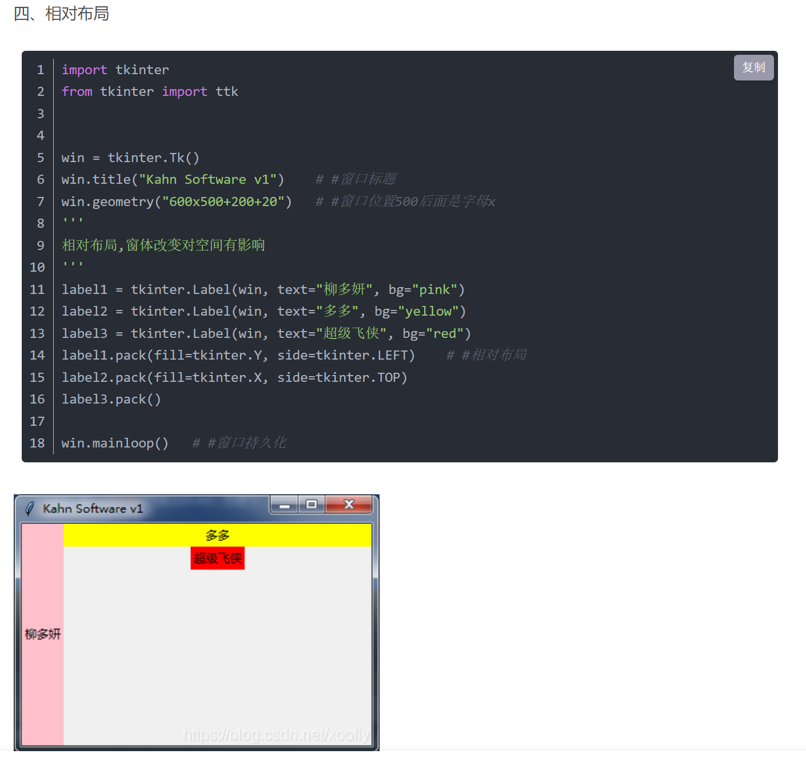
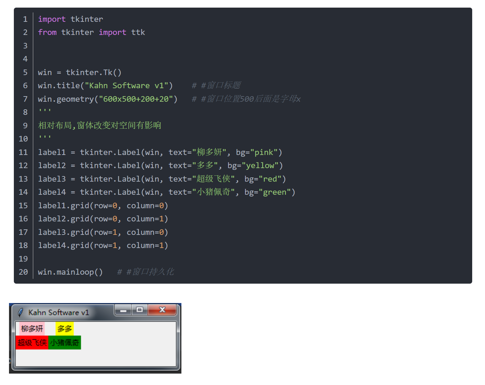

# tk学习仓库

## 项目文件结构

- doc(程序文档文件夹)
- gui(ui界面及逻辑)
    - main_page.py(初始化一个只带菜单导航栏的主界面)
    - main_frame.py(主页显示内容，以及相关的逻辑)
    - save_frame.py(保存界面显示的内容，以及相关的逻辑)
    - search_frame.py(查询界面显示的内容，以及相关的逻辑)
    - about_frame.py(关于界面显示的内容，以及相关的逻辑)
- myutil(工具类)
    - global_var.py(全局变量的工具模块)
    - json_data_manager.py(处理json的工具模块)
    - log.py(处理命令行显示的log的工具模块)
    - mysql_diver.py(mysql数据库的工具模块)
    - ssh_diver.py(链接ssh的工具模块)
- resources(程序使用的资源文件夹)
    - icon(图标文件夹)
- config.py(程序初始化config文件)
- AP_DataBase.json(这个程序的数据存放文件)
- main.py(程序入口文件)
- README.md(项目说明文件)

## 布局

- 一个frame里面只能有一个布局

### 相对布局

- 可以从上到下进行布局
- 用于最外层的整体布局

### 表格布局

- 实现表格布局
- 多用于表单的创建

